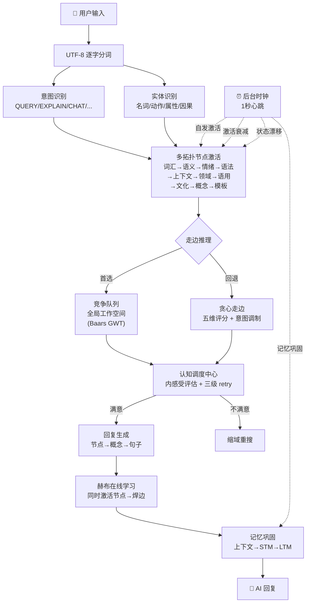
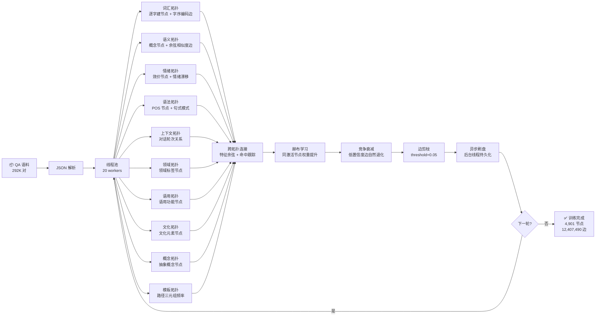

# 玄枢 PivotMind

**多拓扑联想网络认知引擎** — 基于赫布学习的数字生命框架，纯 C（~34,000 行），零 AI 框架依赖。

> 生命不是一个状态，而是一个持续过程。

## 推理流程图



## 批量训练流程



## 核心特性

### 逐字拓扑网络
每个 UTF-8 中文字符作为独立节点，通过有向边承载语义关联。无需预分词——"学习"=`「学」+「习」`同时激活，自动适应新组合。

### 9 层子拓扑 + 模板拓扑
| # | 拓扑 | 节点类型 | 作用 |
|:---:|------|------|------|
| 0 | 词汇 | 逐字 | 基础字符关联 |
| 1 | 语义 | 概念词 | 语义聚类 |
| 2 | 情绪 | 情绪标签 | 情感倾向引导 |
| 3 | 语法 | POS 标签 | 句式骨架（15固定+自动发现） |
| 4 | 上下文 | 对话轮次 | 多轮连贯性 |
| 5 | 领域 | 领域标签 | 话题切换识别 |
| 6 | 语用 | 语用类型 | 请求/陈述/询问区分 |
| 7 | 文化 | 文化元素 | 文化参照 |
| 8 | 概念 | 抽象概念 | 多级抽象推理 |
| 9 | 模板 | 路径三元组 | 多跳推理结构压缩 |

跨拓扑连接（特征余弦相似度 + 动态命中跟踪）实现多层协同推理。

### 竞争队列 + 走边推理
- **首选**：竞争队列（全图激活场 + 全局工作空间竞争读出，基于 Baars GWT 理论）
- **回退**：贪心走边（六维评分函数：边权重 + 置信度 + 动机倾向 + 激活度 + 节点置信度 + 语义相似度）

### 认知调度中心
意图向量 × 上下文关联度 × 新颖性 × 在线学习因子。内感受评估 + 三级 retry 循环——不满意就缩域重搜。

### 数字生命"心跳"
独立后台线程每秒 tick，无人交互时持续运转：
- 激活衰减（每 tick × 0.97）
- 自发激活（每 tick 3 个随机节点，模拟"念头涌现"）
- 状态漂移（drive/emotion/valence 向基线 EMA 回归）
- 记忆巩固（每 10 tick STM→LTM 迁移）

### 在线赫布学习
对话中同时激活的节点对自动增强连接。每条边有三维属性：逻辑强度 + 动机倾向 + 置信度。

### 异步刷盘 + 竞争衰减 + 边剪枝
- **异步刷盘**：后台线程持久化，训练不阻塞
- **竞争衰减**：全局衰减 + Fisher 信息代理保护高频边
- **边剪枝**：自动清理低质量边（threshold=0.05）

### 10 条神经回路
| # | 回路 | 机制 |
|:---:|------|------|
| 1 | satisfaction → valence | 满意度回写效价 |
| 2 | activation → 学习门控 | 低激活拓扑跳过赫布学习（改为衰减学习率） |
| 3 | satisfaction → cognitive_confidence | EMA 更新三维置信度 |
| 4 | 模板增量生长 | 移除幂等守卫，可持续生长 |
| 5 | selection_count → 衰减保护 | 高频边衰减更慢 |
| 6 | selection_count → 赫布 boost | 正反馈循环 |
| 7 | 因果图 → 赫布 | 因果关联概念获得更高权重 |
| 8 | 节点 valence → 全局情绪 | 情绪拓扑污染全局情绪漂移 |
| 9 | LTM → 赫布 | 记忆中重要概念获得更高权重 |
| 10 | POS 句式 → scaffold | 句式骨架约束生成 |

## 与传统 NLP/LLM 对比

| 维度 | 传统 NLP/LLM | 玄枢 PivotMind |
|------|-------------|---------------|
| 知识表示 | 浮点向量 | 结构化节点 + 有向边 + 效价/置信度 |
| 学习方式 | 梯度反向传播（离线） | 赫布同时激活（在线） |
| 推理方式 | 前向传播 | 竞争队列 + 拓扑走边 |
| 时间连续性 | 无状态 | 后台时钟驱动，激活/情绪持续演化 |
| 架构 | 中心化向量空间 | 多拓扑分域 + 跨拓扑连接 |
| 依赖 | PyTorch/CUDA | 仅 pthread + OpenMP |
| 可解释性 | 黑盒 | 节点-边显式路径，全程可追溯 |
| 推理吞吐 | 10-100 token/s (GPU) | 373 QA/s (CPU 20线程) |

## 当前状态

| 指标 | 数值 |
|------|------|
| 核心代码 | 66 源文件 + 60 头文件 (~34,000 行) |
| 训练数据 | 292,433 QA 对（hermes_knowledge_base.json） |
| 最大节点数 | 4,901 |
| 最大边数 | 12,407,490 |
| 跨拓扑连接 | ~86,000 |
| 平均置信度 | 0.957（20 epoch） |
| 训练速度 | 373 QA/s（20 线程） |
| 推理内存 | ~50 MB |
| 训练内存 | ~280 MB |

## 快速开始

### 编译

```bash
# Linux / macOS (需 GCC + pthread + OpenMP)
make all

# Windows (MSYS2 MinGW-w64)
build_bl.bat
```

### 运行

```bash
# 批量训练（20 epoch）
./build/bin/batch_learn.exe

# 交互对话（需先有状态文件）
./build/bin/digital_life
```

### 构建目标

| 命令 | 说明 |
|------|------|
| `make all` | 所有目标 |
| `make batch-learn` | 批量训练工具 |
| `build_bl.bat` | Windows 编译（src/*.c + tools/*.c） |
| `build_debug.bat` | 调试编译 (-O0 -g) |

## 项目结构

| 目录 | 文件数 | 用途 |
|------|:---:|------|
| `src/` | 66 | 核心引擎 |
| `include/` | 60 | 头文件 |
| `demos/` | 1 | digital_life 主程序 |
| `tools/` | 6 | batch_learn, template_build 等 |
| `tests/` | 8 | 单元 + 集成测试 |
| `data/` | - | QA 语料（JSON/TXT） |
| `scripts/` | 10 | Python 训练辅助脚本 |
| `changelogs/` | - | 改动记录 |
| `reports/` | - | 审查/修复报告 |
| `docs/` | - | 架构文档 |

## 已知局限

1. **中文优先**：逐字拆分，英文/混合输入处理有限
2. **回复连贯性**：拓扑联想路线输出不如 LLM 流畅
3. **纯 CPU**：无 GPU 加速（pthread + OpenMP）
4. **状态文件**：x86_64 和 ARM 二进制不兼容
5. **并行瓶颈**：粗粒度锁限制，当前最优 ~4-8 线程

## 许可

Apache License 2.0
