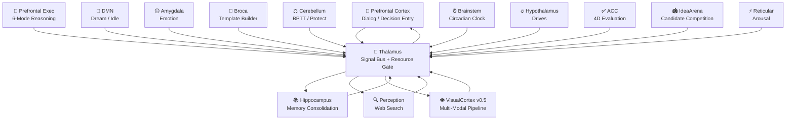
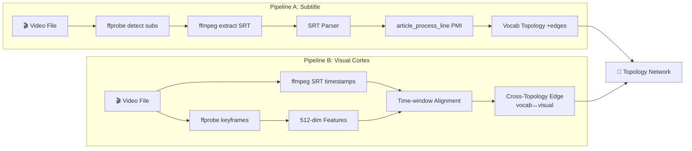

<div align="center">

# 玄枢 PivotMind

### A Brain-Inspired Semantic Association Engine
**Pure C · Zero AI Framework Dependencies · Runs on ARM Embedded Boards**

[English](README.md) · [简体中文](README.zh-CN.md) · [日本語](README.ja.md) · [한국어](README.ko.md) · [Русский](README.ru.md)

[](changelogs/)
[](LICENSE)
[](https://en.wikipedia.org/wiki/C99)
[](#running-on)
[](#quick-start)

> Intelligence is not a stack of matrix multiplications,
> but ripples of activation spreading through a reasoning network.

</div>

---

## What is PivotMind

PivotMind is a **brain-inspired cognitive engine** built on
[TraceWisdomNetwork](#tracewisdomnetwork) +
[Hebbian Learning](#core-mechanisms) +
[Multi-Layer Diffusion Reasoning](#multi-layer-diffusion-engine).
No external Transformer dependencies. No pretrained embedding vectors.
Just nodes, edges, activation, and decay — powered by a relentless background clock.

**Current Version: v0.5.0** — 14 fully-implemented brain regions, emergent POS system, parallel multi-learner, PFE reasoning orchestration, 512-dim feature vectors, POS grammar mapping, edge specificity weighting, **multi-modal visual pipeline (VisualCortex + MediaReader)**, zero compile warnings.

**Codebase: 88 source files (~49,600 lines C) + 91 headers (~12,800 lines) + tools/tests/demos (~13,000 lines) = ~75,500 total lines.**

### TraceWisdomNetwork

Each concept is a node. Co-occurrence creates an edge. Edges carry a triple attribute:
**weight × confidence × motivational bias**.
Twelve sub-topologies (vocabulary / semantic / emotion / syntax / context / domain / pragmatics / culture / concept / master / template / **visual**)
each form an independent reasoning network, interconnected through cross-topology links with O(1) adjacency indexing.
Activation diffuses simultaneously across layers, with competition selecting the winner as output.

### Why This Approach

| Traditional LLM       | PivotMind                                              |
|-----------------------|--------------------------------------------------------|
| Token prediction, stateless | Node activation, continuous internal state       |
| Gradient-based offline batch training | Hebbian online + Skip-gram pretraining     |
| Single embedding space | 12 independent sub-topologies + 512-dim features       |
| Neural network black box | Explicit node-edge paths, fully traceable            |
| Requires GPU + massive VRAM | pthread + OpenMP only, runs on ARM embedded     |
| Inference separate from learning | Conversation IS learning                    |
| No physiological awareness | Interoceptive self-monitoring, 3-tier health response |
| Frozen after training | 24/7 continuous background learning                     |

---

## Brain Region Architecture

PivotMind models mammalian cortical functional divisions — 14 brain regions/subsystems, each with dedicated responsibilities, communicating through the Thalamus signal bus.
**All 14 regions are fully implemented with zero stub code.**



| Brain Region       | File                       | Lines | Function                                                       |
|--------------------|----------------------------|-------|----------------------------------------------------------------|
| **Prefrontal**     | `prefrontal.c`             | 132   | Dialog generation, diffusion → ACC adaptive gating              |
| **Prefrontal Exec**| `prefrontal_executive.c`   | 1,502 | 6-mode reasoning, task decomposition, conflict detection       |
| **Hippocampus**    | `hippocampus.c`            | 135   | Memory consolidation, QA replay, perception coupling            |
| **DMN**            | `dmn.c`                    | 46    | Default Mode Network: dream association, idle exploration      |
| **Amygdala**       | `amygdala.c`               | 97    | Emotional valence sampling, explore / exploit balance          |
| **Perception**     | `perception.c`             | 838   | Web search (Sogou+Bing dual provider), article_reader pipeline |
| **Broca's Area**   | `broca.c`                  | 56    | Template auto-building and decay scheduling                    |
| **Cerebellum**     | `cerebellum.c`             | 80    | BPTT fine-tuning, CPU/memory resource protection               |
| **Hypothalamus**   | `hypothalamus.c`           | 149   | 4D drive regulation (curiosity/acquisition/social/comfort)     |
| **Thalamus**       | `thalamus.c`               | 540   | Signal bus, resource gating, inter-region routing, tool slots  |
| **Brainstem**      | `brainstem.c`              | 613   | Circadian heartbeat, activation decay, spontaneous activation  |
| **Cingulate (ACC)**| `cingulate.c`              | 223   | 4D sequence evaluation (semantic + template + emotion + length)|
| **IdeaArena**      | `idea_arena.c`             | 722   | Multi-candidate 5D competition, lateral inhibition, dopamine   |
| **Reticular**      | `reticular.c`              | 133   | Arousal/alertness level regulation                             |
| **VisualCortex** 🆕| `visual_cortex.c`          | 550   | Frame extraction + SRT subtitle + cross-modal alignment        |

---

## Core Mechanisms

### Multi-Layer Diffusion Engine

Input is tokenized via sliding window, then diffuses simultaneously across layers:

- **Vocabulary** — direct literal matching, fast recall
- **Semantic** — cross-topology association across 12 sub-topologies
- **Template** — syntactic pattern recognition, guiding connector insertion
- **Emotion** — valence × arousal weighting, modulating candidate priority

**v0.4.8 improvement**: Function word filtering — `is_function_word()` checks ~130 Chinese + English function words, filtering at 3 pipeline stages (active set update, weighted scoring, output) to prevent high-connectivity function words from dominating the output. Lateral inhibition ensures content word output diversity.

### Reasoning Orchestration (PFE)

The Prefrontal Executive automatically assesses question complexity and matches one of 6 reasoning modes:

| Mode       | Trigger Keywords        | Strategy                              |
|------------|-------------------------|---------------------------------------|
| DIRECT     | default                 | Single diffusion association          |
| DECOMPOSE  | why / because           | Definition → causality → synthesis     |
| COMPARE    | compare / difference    | Attribute extraction → contrast       |
| HOWTO      | how to                  | Preconditions → step sequence         |
| ABDUCE     | what if / assume        | Baseline → chain reaction             |
| ANALOGY    | analogy / similar       | Structural mapping                    |

Subgoals are recursively decomposed (configurable depth). Conflict detection + IdeaArena 5D competition (goal-fit + consistency + novelty + valence + composability) selects optimal paths, producing explainable reasoning chains. Strategy weights support EMA self-learning with persistence.

### Emergent POS System **NEW v0.4.3**

Abandons hardcoded POS dictionaries. Humans provide only 3-5 "seed anchor" words per word class (~50 total, Chinese + English). The system initializes anchor centroids from seed words' 512-dim Hebbian feature vectors. At runtime:

1. New words are classified to the nearest word class via cosine similarity (threshold 0.50)
2. Successful classification → EMA micro-tuning of the anchor centroid (learning rate 0.001)
3. Unclassified pool ≥ 10 words → greedy clustering (cosine similarity > 0.65, cluster ≥ 5 members) → **new word class emerges**

Three-layer routing ensures smooth transition: emergent anchors (priority) → cross-topology syntax links (auxiliary) → hardcoded dictionary (cold-start fallback). Anchor centroids persist to `emergent_pos.bin`, surviving restarts.

### Interoceptive Self-Monitoring

Continuously monitors RSS memory, connection growth rate, and reasoning latency with 3-tier response:

| Level         | Condition   | Action                                            |
|---------------|-------------|---------------------------------------------------|
| 🟢 GREEN      | Normal      | Normal operation                                  |
| 🟡 YELLOW     | Warning     | Log alert + raise learning threshold              |
| 🔴 RED        | Critical    | Emergency save + bulk prune weak edges            |

---

## Multi-Modal Pipeline **NEW v0.5.0**

The VisualCortex brain region ingests video/audio content through two data pipelines:



Task queue: Gateway enqueue → Brainstem tick (throttle-gated) → dequeue 1 file/tick → frames+SRT+align+edges.

**Why early education videos?** Natural QA patterns, simple repeated language, perfect audio-visual sync — ideal for multi-modal semantic anchoring.

---

## Learning System

PivotMind has multiple parallel learning mechanisms spanning the full lifecycle from word embedding pretraining to online fine-tuning.

### Pretraining System

Based on `pretrain.c` (1,624 lines): supports **Skip-gram and CBOW** word embedding pretraining.

- Dynamic window size (max 10), negative sampling (default 5), sampling rate control
- Momentum (0.9), gradient clipping (threshold 5.0), phrase detection (PMI)
- Learning rate scheduling: linear decay from 0.025 to 0.0001
- Checkpoint save/resume for long training runs
- `feature_pretrain.c` + `feature_learn.c`: feature vector training and import

### Learner Matrix

| Learner | File | Method | Description |
|---------|------|--------|-------------|
| **Autonomic** | `autonomic_learner.c` | Hebbian online | Co-occurrence reinforcement, edge confidence +0.05, 16-shard concurrent updates |
| **Active** | `active_learner.c` | 24/7 background | Auto-acquires new knowledge, analyzes concept relationships, expands topology |
| **Self** | `self_learner.c` | Curiosity-driven | Curiosity sampling → deep walk → knowledge review → self-correction → novelty update |
| **BPTT** | `bptt_learner.c` | Temporal backprop | RNN + Linear layers, Adam optimizer (lr=0.001), online sequential learning |

### Catastrophic Forgetting Prevention

`catastrophic_forgetting.c` (1,385 lines, 577-line header): Based on **EWC (Elastic Weight Consolidation)**, using Fisher information matrix to mark parameter importance, selectively protecting prior knowledge from being overwritten during new learning.

---

## Neural Network Subsystem

While PivotMind's core is topology-based reasoning, it also includes a complete lightweight neural network engine:

| Module | File | Description |
|--------|------|-------------|
| **Tensor Ops** | `tensor.c` (889 lines) | Multi-dim tensor create/destroy/broadcast/clone/requires_grad/view |
| **Matrix Ops** | `matrix_ops.c` | Matrix multiply/transpose/add/scale |
| **Gradient Ops** | `gradient_ops.c` | Backpropagation gradient computation |
| **Layer** | `layer.c` | 8 layer types: LINEAR/RELU/SIGMOID/TANH/SOFTMAX/DROPOUT/EMBEDDING/SIMPLE_RNN |
| **LSTM** | `layer_lstm.c` (713 lines) | Full LSTM: W/R matrices, bias, bidirectional, layer normalization |
| **GRU** | `layer_gru.c` (621 lines) | Full GRU: update/reset gates, bidirectional, layer normalization |
| **RNN** | `layer_rnn.c` + `layer_rnn_backward.c` | Simple RNN forward/backward + Embedding layer (Xavier init) |
| **Model** | `model.c` + `model_io.c` | Multi-layer stacking, forward pass, MSE loss, model serialization |
| **Generative Model** | `generative_model.c` | Vocabulary (PAD/SOS/EOS/UNK) + text generation pipeline |
| **Trainer** | `trainer.c` | Mini-batch training, learning rate scheduling, statistics |
| **Optimizer** | `optimizer.c` | SGD / Adam (β1=0.9, β2=0.999, ε=1e-8) / RMSprop |
| **Quantization** | `quantization.c` | FP16 / INT8 / INT4 / INT2 precision reduction |
| **Pruning** | `pruning.c` | MAGNITUDE / RANDOM / GRADIENT / STRUCTURED strategies |
| **Attention** | `attention.c` | Bahdanau / Luong / Self-Attention / Multi-Head Attention |

---

## Quick Start

### Build

```bash
# Requires GCC + pthread + OpenMP (needs libcurl + openssl, otherwise zero dependencies)
make all

# ARM cross-compilation
make CC=aarch64-linux-gnu-gcc all

# Debug build (with ASAN address/UB detection)
make asan

# Run all unit tests
make test
```

### Run

```bash
# Interactive gateway (recommended)
./build/bin/pivotmind_gateway

# CLI interactive mode
./build/bin/digital_life
```

The gateway listens on `:8080` by default, with an HTML dashboard (auto-refreshing JS) at `/`.

### API Examples

```bash
# Ask a question
curl -X POST http://localhost:8080/chat \
  -H "Content-Type: application/json" \
  -d '{"query":"What is consciousness?"}'

# Feed learning material
curl -X POST http://localhost:8080/learn \
  -H "Content-Type: application/json" \
  -d '{"text":"Consciousness is the subjective experience produced by neural networks."}'

# Check status (nodes, uptime, clock ticks, brain region info)
curl http://localhost:8080/status

# Health check
curl http://localhost:8080/health

# Feed video for multi-modal learning (v0.5)
curl -X POST http://localhost:8080/media/feed \
  -H "Content-Type: application/json" \
  -d '{"path":"/data/cartoons/babybus_01.mp4","mode":"visual"}'

# Check multi-modal pipeline status
curl http://localhost:8080/media/status
```

### Build Targets

| Command | Description |
|---------|-------------|
| `make all` | Build all targets |
| `make gateway` | Build HTTP gateway only |
| `make digital-life` | Build CLI interactive version |
| `make seed-builder` | Build seed topology tool |
| `make debug-seed` | Build debug seed tool |
| `make batch-learn` | Batch training tool |
| `make corpus-train` | Corpus training tool |
| `make template-build` | Template construction tool |
| `make test-dialog` | Dialog testing tool |
| `make clean` | Clean build artifacts |
| `make test` | Run all unit tests |

---

## Project Structure

```
pivotmind/
├── src/               # 88 core source files (~49,600 lines C)
├── include/           # 91 header files (~12,800 lines)
├── demos/             # Gateway and interactive entry
├── tools/             # 57 tools (training/debugging/data processing/corpus download)
├── tests/             # Unit tests (19) + integration tests + regression suite
├── scripts/           # Automation scripts (feeding, knowledge download, etc.)
├── changelogs/        # 56 version changelogs (000-055)
├── docs/              # Architecture documentation and diagrams
├── data/              # Runtime data (hermes knowledge base 25MB, etc.)
└── libs/              # Third-party libraries
```

---

## Version History

| Version    | Highlights                                                                          |
|------------|-------------------------------------------------------------------------------------|
| v0.1.x     | Basic walk reasoning, competitive queue, state persistence                          |
| v0.2.x     | Multi-layer diffusion, Hippocampus/DMN/Perception, interoceptive monitoring         |
| **v0.3.0** | Prefrontal Executive (6-mode reasoning), IdeaArena 5D, strategy weight self-learning |
| **v0.4.0** | Code simplification, brain boundary fixes, Broca upgrade, Hypothalamus/Thalamus/Brainstem |
| **v0.4.1** | Web fetch refactor (libcurl engine), Bing/Bing News providers, news timer           |
| **v0.4.2** | Comprehensive realloc dangling pointer fix (15+ sites), 4-round memory safety audit |
| **v0.4.3** | **Emergent POS** — seed anchors + 512-dim feature clustering, grammar emerges from data |
| **v0.4.8** | Diffusion function word filter (~130 words), cross-layer index fix, double-free race fix |
| **v0.4.11** | Bilingual grammar engine (verb valency + English POS + diffusion activation optimization) |
| **v0.4.12** | Chat quality overhaul (online learning + multi-turn context + output length control) |
| **v0.4.13** | POS grammar mapping, edge specificity weighting, zero compile warnings |
| **v0.5.0** | **Multi-modal pipeline** — VisualCortex brain region, MediaReader SRT pipeline, cross-modal alignment, task queue model |

> Detailed changelogs: v0.3.0 → [changelogs/032-v0.3.0-reasoning-architecture.md](changelogs/032-v0.3.0-reasoning-architecture.md) ｜ v0.4.0 → [changelogs/034-v0.4.0-code-simplify-brain-boundary.md](changelogs/034-v0.4.0-code-simplify-brain-boundary.md) ｜ v0.4.3 → [changelogs/042-emergent-pos-anchor.md](changelogs/042-emergent-pos-anchor.md) ｜ v0.5.0 → [changelogs/055-multimodal-v0.5.0.md](changelogs/055-multimodal-v0.5.0.md)

---

## Known Limitations

- **Generation fluency** — Associative path output is less natural than LLM generated text (actively iterating)
- **No GPU acceleration** — Pure CPU + pthread + OpenMP
- **Binary state files** — Not cross-architecture compatible (x86_64 and ARM; text format planned)
- **Single-node only** — No distributed multi-node topology support yet
- **Multi-modal v0.5.0** — Visual pipeline works; CLIP encoder + Whisper ASR integration pending (Phase 2-3)

---

## Roadmap

- [ ] FPGA deployment (ultimate goal: hardware-level neuromorphic computing)
- [ ] Distributed multi-node topology (cross-device activation propagation)
- [x] ~~Visual / auditory multimodal input interfaces~~ → **v0.5.0 implemented**: VisualCortex + MediaReader
- [ ] JSON/MessagePack text format persistence (cross-architecture compatibility)

---

## Contributing

Issues and Pull Requests are welcome. For major changes, please open an issue first to discuss what you would like to change.

---

## License

[Apache License 2.0](LICENSE)

---

<a name="running-on"></a>
*Currently running on **EAIDK-610** (RK3399 ARM Cortex-A72, 3.8GB RAM).*
*Goal: A self-sustaining distributed cognitive engine deployable on embedded hardware.*

|<div align="center">
|
|Maintained by [陈道祥 (afd-ll)](https://github.com/afd-ll)
|
|[⭐ Star this repo](https://github.com/afd-ll/PivotMind) · [Report a bug](https://github.com/afd-ll/PivotMind/issues) · [Read the docs](ARCHITECTURE.md)
|
|</div>
