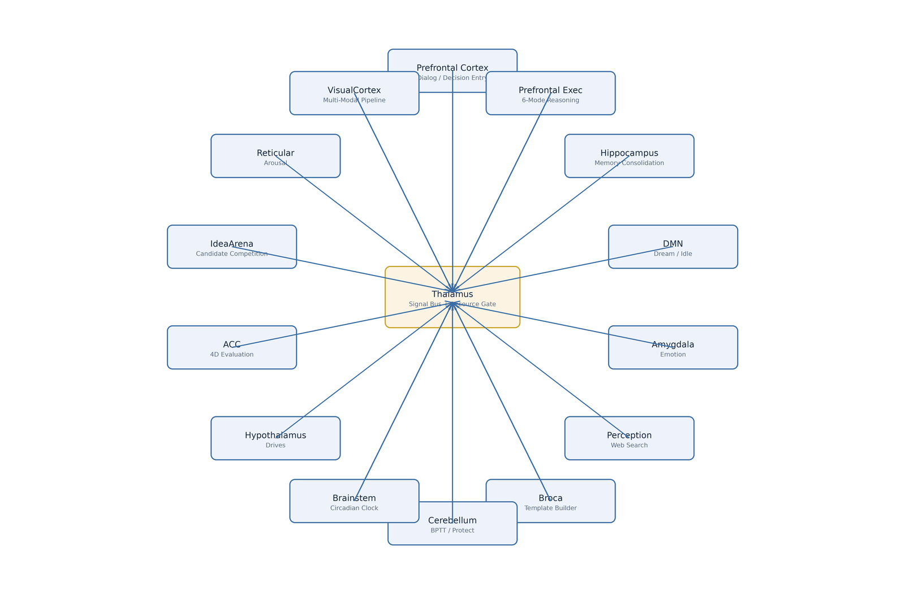

<div align="center">

# 玄枢 PivotMind

### A Brain-Inspired Cognitive Engine in Pure C

**Zero AI framework dependencies · No GPU required · Runs continuously on ARM boards**

[English](README.md) · [简体中文](README.zh-CN.md)

[](changelogs/)
[](LICENSE)
[](https://en.wikipedia.org/wiki/C99)
[](#quick-start)
[](#quick-start)

</div>

---

## What This Is

PivotMind is a cognitive engine written in pure C. It does not use transformer models, pretrained embeddings, or any AI framework. Concepts are nodes; co-occurrence creates edges; activation spreads through a multi-layer network; competition picks the output. It learns continuously from corpus via Hebbian statistics and is designed to run unattended on low-resource ARM boards (tested on RK3399, 4GB RAM).

**Current version: v0.5.9** — ~75,500 lines of C (88 source files + 91 headers + tools/tests/demos), zero compile warnings.

## Architecture

### 14 Brain Regions

PivotMind models mammalian cortical functional divisions as 14 implemented regions communicating through a Thalamus signal bus. No stubs.

<p align="center"></p>

| Brain Region       | File                       | Lines | Function                                                       |
|--------------------|----------------------------|-------|----------------------------------------------------------------|
| **Prefrontal**     | `prefrontal.c`             | 132   | Dialog generation, diffusion → ACC adaptive gating              |
| **Prefrontal Exec**| `prefrontal_executive.c`   | 1,502 | 6-mode reasoning, task decomposition, conflict detection       |
| **Hippocampus**    | `hippocampus.c`            | 135   | Memory consolidation, QA replay, perception coupling            |
| **DMN**            | `dmn.c`                    | 46    | Default Mode Network: dream association, idle exploration      |
| **Amygdala**       | `amygdala.c`               | 97    | Emotional valence sampling, explore / exploit balance          |
| **Perception**     | `perception.c`             | 838   | Web search (Sogou+Bing dual provider), article_reader pipeline |
| **Broca's Area**   | `broca.c`                  | 56    | Template auto-building and decay scheduling                    |
| **Cerebellum**     | `cerebellum.c`             | 80    | BPTT fine-tuning, CPU/memory resource protection               |
| **Hypothalamus**   | `hypothalamus.c`           | 149   | 4D drive regulation (curiosity/acquisition/social/comfort)     |
| **Thalamus**       | `thalamus.c`               | 540   | Signal bus, resource gating, inter-region routing, tool slots  |
| **Brainstem**      | `brainstem.c`              | 613   | Circadian heartbeat, activation decay, spontaneous activation  |
| **Cingulate (ACC)**| `cingulate.c`              | 223   | 4D sequence evaluation (semantic + template + emotion + length)|
| **IdeaArena**      | `idea_arena.c`             | 722   | Multi-candidate 5D competition, lateral inhibition, dopamine   |
| **Reticular**      | `reticular.c`              | 133   | Arousal/alertness level regulation                             |
| **VisualCortex**   | `visual_cortex.c`          | 550   | Frame extraction + SRT subtitle + cross-modal alignment        |

### 12-Layer Topology

Each concept lives in one of 12 sub-topologies (11 sub + 1 master), each an independent reasoning network:

`vocabulary / semantic / emotion / syntax / context / domain / pragmatics / culture / concept / template / visual / master`

Cross-topology links use O(1) adjacency indexing. Activation diffuses simultaneously across layers; competition selects the winner as output.

### Design Difference vs Traditional LLMs

| Traditional LLM       | PivotMind                                              |
|-----------------------|--------------------------------------------------------|
| Token prediction, stateless | Node activation, continuous internal state       |
| Gradient-based offline batch training | Hebbian online + Skip-gram pretraining     |
| Single embedding space | 12 independent sub-topologies + 512-dim features       |

## Core Mechanisms

### Hebbian Co-occurrence Learning

All structure emerges from corpus statistics. Words/concepts that appear together build edges; repeated co-occurrence strengthens them. No hand-written vocabulary, semantics, or templates — everything must emerge.

- **Word-layer architecture**: characters stay in the character topology; words are promoted to the concept topology with co-occurrence edge weights
- **Two-channel emergence**: relative (≥1.5×) and absolute (≥0.85) thresholds for new word candidates
- **Word consolidation** (runtime capability): holds a write lock during promotion to prevent SIGSEGV on concurrent access

### Multi-Layer Diffusion Engine

The only output path. Activation spreads across all topologies with decay; top-K candidates compete in IdeaArena (5D scoring: semantic + template + emotion + length + dopamine). No database lookup, no hardcoded responses.

### Emergent POS System

Part-of-speech anchors emerge from corpus via the feed pipeline (`article_reader_set_emergent_pos`). Clustering runs every 500 feeds (pool ≥10, threshold 0.50, cap 16). Template patterns are built from POS sequences — templates grow from corpus, not from hand-written grammar.

### Emergent Void Characters

Void/function characters (之/的/了 etc.) emerge through three gates (single-char nodes + degree threshold / entropy + word-formation rate). 25 void characters emerged from a small corpus (12 core + 10 proper-noun + 3 more).

### Memory & Stability

- Atomic state persistence (tmp + rename), 180s graceful-shutdown window
- cgroup memory wall (1800MB) + periodic `malloc_trim(0)` — RSS breathes instead of growing monotonically
- Crash watchdog + load verification after restart

## Current Status (v0.5.9, measured 2026-08)

| Metric | Value |
|--------|-------|
| Nodes | 380,000+ across topologies (still growing) |
| Resident memory | 623MB on RK3399 (4GB board, 24/7 operation) |
| Full state load | <5s at 130,000+ nodes |
| Runtime | 24/7 via systemd, continuous web crawling + corpus feeding |
| POS anchors | 8 hardcoded + emergent extra classes |

## Quick Start

### Build

```bash
# Requires GCC + pthread + OpenMP (libcurl + openssl optional for web features)
make -j$(nproc) gateway

# ARM cross-compilation
make CROSS_COMPILE=aarch64-linux-gnu- gateway

# Debug build (ASAN address/UB detection)
make DEBUG=1 gateway

# Run all unit tests
make test
```

### Run

```bash
# Interactive gateway (recommended) — HTTP API on port 8080
./build/bin/pivotmind_gateway 8080

# CLI interactive mode
./build/bin/pivotmind_cli
```

### API Examples

```bash
# Ask a question
curl -X POST http://localhost:8080/chat -H "Content-Type: application/json" \
  -d '{"msg":"什么是政治？"}'

# Feed learning material
curl -X POST http://localhost:8080/learn -H "Content-Type: application/json" \
  -d '{"msg":"你的学习文本"}'        # (rate-limit applies; async queue, 2 workers)

# Check status (nodes, uptime, clock ticks, brain region info)
curl http://localhost:8080/status

# Health check
curl http://localhost:8080/health
```

### Feed Corpus

Corpus can be fed via the `/learn` API (multiple scripts may feed in parallel). Feeding is the primary learning path — the engine builds co-occurrence statistics from whatever you give it.

## Project Structure

```
src/            Engine source (~49,600 lines)
include/        Public headers (~12,800 lines)
demos/          Gateway & CLI entrypoints
tools/          Utilities (state dump, merge, convert)
tests/          Unit tests
changelogs/     Version changelogs
diagrams/       Architecture diagrams
```

## Version History

| Version    | Highlights                                                                          |
|------------|-------------------------------------------------------------------------------------|
| v0.1.x     | Basic walk reasoning, competitive queue, state persistence                          |
| v0.2.x     | Multi-layer diffusion, Hippocampus/DMN/Perception, interoceptive monitoring         |
| **v0.3.0** | Prefrontal Executive (6-mode reasoning), IdeaArena 5D, strategy weight self-learning |
| v0.4.x     | POS system, template growth, dialog system                                          |
| **v0.5.0** | Visual pipeline, word-layer semantic field, PFE reasoning                           |
| v0.5.9     | Void characters, POS feed pipeline, crash protection, memory breathing              |

Full changelog: [changelogs/](changelogs/)

## Known Limitations

Honest assessment of the current state:

- **Word-layer stitching**: replies are activation-propagation results, not grammatically guaranteed sentences. Current output is still at the "word association" stage (e.g. a question about *politics* may answer with the co-occurring word *people*)
- **Upper-level concepts not yet formed**: no true concept abstraction yet — the syntax topology is still accumulating POS anchors
- **Corpus bias**: current corpus skews heavily toward political/historical texts (selected works collection), which dominates co-occurrence statistics; modern spoken-language corpus (target ratio ~1:3 political:life) is still needed
- **Toy-stage honesty**: this is a long-term research project in its toy stage, not a product

## Roadmap

- **Short-term**: scale up modern spoken-language corpus; continue POS anchor accumulation; verify concept emergence as syntax topology crosses critical mass
- **Mid-term**: self-awareness experiments (self node + action-observation loop); embodied learning experiments in Minecraft as a virtual hand (action → result causal statistics)
- **Long-term**: offline/embodied intelligence on small devices — "if it runs on a small board, it runs anywhere"

## Contributing

This is a personal research project. Issues and pull requests are welcome, but major design directions are decided by the author.

## License

[Apache 2.0](LICENSE)
