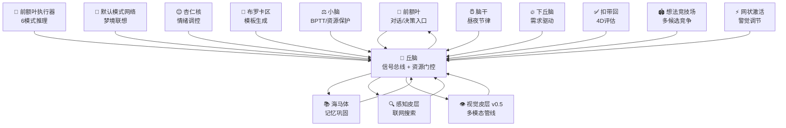
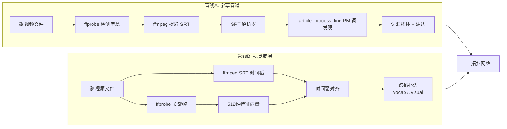

<div align="center">

# 玄枢 PivotMind · 溯智网络认知引擎

### A Brain-Inspired Semantic Association Engine
**纯 C · 零 AI 框架依赖 · 跑在 ARM 嵌入式板**

[English](README.md) · [简体中文](README.zh-CN.md) · [日本語](README.ja.md) · [한국어](README.ko.md) · [Русский](README.ru.md)

[](changelogs/)
[](LICENSE)
[](https://zh.wikipedia.org/wiki/C99)
[](#运行平台)
[](#快速开始)

> 智能不是矩阵乘法的堆叠，
> 而是激活在溯智网络中蔓延的涟漪。

</div>

---

## 这是什么

玄枢是一套**仿脑认知引擎**，基于
[溯智网络](#溯智网络) +
[赫布学习](#核心机制) +
[多层扩散推理](#多层扩散引擎)。
没有 Transformer 外部依赖，没有预训练 embedding 向量。
节点、边、激活、衰减 —— 以及一个永不停歇的后台时钟驱动整个系统。

**当前版本：v0.5.4** —— 14 脑区完整架构、涌现式词类系统、多学习器并行、PFE 推理编排、512 维特征向量、POS 语法映射、边特异性权重、**多模态视觉管线 + /learn PMI 词共现管线（VisualCortex + MediaReader）**、编译零警告。

**代码规模：88 个源文件（~49,600 行 C） + 91 个头文件（~12,800 行） + 工具/测试/演示（~13,000 行）= 约 75,500 行。**

### 溯智网络

每个概念是一个节点，共现即建边。边携带**权重 × 置信度 × 动机倾向**三维属性。
12 个子拓扑（词汇/语义/情绪/语法/上下文/领域/语用/文化/概念/主拓扑/模板/**视觉**）
各为一张独立的溯智网络，通过跨拓扑连接用邻接表实现 O(1) 索引。
激活沿多层同时扩散，竞争胜出者构成输出。

### 为什么这样做

| 传统 LLM               | 玄枢                                              |
|------------------------|---------------------------------------------------|
| Token 预测，无状态     | 节点激活，有连续内部状态                          |
| 梯度离线批量训练       | 赫布在线实时学习 + Skip-gram 预训练                |
| 单一 Embedding 空间    | 12 个子拓扑独立学习 + 512 维特征向量              |
| 神经网络黑盒           | 节点-边显式路径，完全可追溯                       |
| 需要 GPU + 大量显存    | 仅 pthread + OpenMP，跑在 ARM 嵌入式板            |
| 推理与学习分离         | 对话即学习，学习即对话                            |
| 无生理感知             | 内感受自检，三级健康响应                          |
| 离线训练完就冻结       | 7×24 小时持续后台学习                             |

---

## 脑区架构

玄枢按哺乳动物大脑皮层的功能分区建模，14 个脑区/子系统各司其职，通过丘脑信号总线通信。
**全部 14 个脑区均已完成实现，无占位代码。**



| 脑区             | 文件                       | 行数 | 职责                                                         |
|------------------|----------------------------|------|--------------------------------------------------------------|
| **前额叶**       | `prefrontal.c`             | 132  | 对话生成，diffusion → ACC 自适应门控                         |
| **前额叶执行器** | `prefrontal_executive.c`   | 1,502 | 6 模式推理编排：任务分解、子目标调度、冲突检测、综合输出     |
| **海马体**       | `hippocampus.c`            | 135  | 记忆巩固、QA 重放、感知联动                                  |
| **DMN**          | `dmn.c`                    | 46   | 默认模式网络：梦境联想、闲暇探索                             |
| **杏仁核**       | `amygdala.c`               | 97   | 情绪效价采样、探索/利用平衡                                  |
| **感知皮层**     | `perception.c`             | 838  | 联网搜索（搜狗+Bing+双备份）、article_reader 语义理解管线    |
| **布罗卡区**     | `broca.c`                  | 56   | 模板自动构建与衰减调度                                       |
| **小脑**         | `cerebellum.c`             | 80   | BPTT 微调、CPU/内存资源保护                                  |
| **下丘脑**       | `hypothalamus.c`           | 149  | 四维需求驱动（好奇/获取/社交/舒适）、昼夜耦合                  |
| **丘脑**         | `thalamus.c`               | 540  | 信号总线、资源门控、脑区间通信路由、工具槽位分配              |
| **脑干**         | `brainstem.c`              | 613  | 节律心跳、激活衰减、自发激活、存盘调度、堆监控                |
| **扣带回 (ACC)** | `cingulate.c`              | 223  | 四维序列评估（语义+模板+情绪+长度）、自适应门控              |
| **想法竞技场**   | `idea_arena.c`             | 722  | 多候选五维竞争选择、侧抑制、多巴胺调节、赢家反馈              |
| **网状激活系统** | `reticular.c`              | 133  | 觉醒/警觉水平调节                                                |
| **视觉皮层** 🆕  | `visual_cortex.c`          | 550  | 帧提取 + SRT 字幕 + 时间窗对齐 + 跨模态边建立               |

---

## 核心机制

### 多层扩散引擎

输入经滑动窗口分词后，在多层网络同步扩散：

- **词汇层** —— 直接字面匹配，快速召回
- **语义层** —— 12 子拓扑跨层联想，触达相关概念
- **模板层** —— 识别句式模式，指导连接词插入
- **情绪层** —— valence × arousal 加权，影响候选优先级

**v0.4.8 改进**：虚词过滤——扩散引擎内置 `is_function_word()` 检查（~130 个中英文虚词），在三层过滤（活跃集更新、加权评分、输出）中拦截高连接度虚词，防止 "the be not to have are..." 或 "的了是在……" 这类虚词串污染输出。侧抑制机制保证内容词输出多样性。

### 推理编排 (PFE)

前额叶执行器自动判断问题复杂度，匹配 6 种推理模式：

| 模式       | 触发词                | 策略                              |
|------------|-----------------------|-----------------------------------|
| DIRECT     | 默认                  | 单次扩散联想                      |
| DECOMPOSE  | 为什么/原因           | 定义 → 因果 → 综合                |
| COMPARE    | 比较/区别/不同        | 属性提取 → 对比                   |
| HOWTO      | 怎么/如何             | 前置条件 → 步骤序列               |
| ABDUCE     | 如果/假设             | 基线 → 连锁反应                   |
| ANALOGY    | 类比/类似             | 结构映射                          |

子目标递归分解（深度可配），冲突检测 + IdeaArena 五维竞争（目标匹配度 + 一致性 + 新颖度 + 情绪效价 + 可组合性）选出最佳路径，输出可解释推理链。策略权重支持 EMA 自学习和持久化。

### 涌现式词类系统 (Emergent POS) **NEW v0.4.3**

抛弃硬编码词性字典。人类只提供每词类 3-5 个"种子锚点"词（中英各 ~50 个），系统用种子词的 512 维 Hebbian 特征向量初始化锚点中心。运行时：

1. 新词通过余弦相似度自动归入最接近的词类（阈值 0.50）
2. 归类成功后以 EMA（学习率 0.001）微调锚点中心
3. 未分类词超过 10 个 → 贪婪聚类（余弦相似度 > 0.65，簇 ≥ 5 成员）→ **涌现新词类**

三层路由保证平滑过渡：涌现锚点（优先） → 跨拓扑 syntax 连接（辅助） → 硬编码字典（冷启动兜底）。锚点中心持久化到 `emergent_pos.bin`，重启不丢失。

### 内感受自检

持续监测 RSS 内存、连接增速、推理延迟，三级响应：

| 级别      | 条件   | 动作                                |
|-----------|--------|-------------------------------------|
| 🟢 GREEN  | 正常   | 正常运行                            |
| 🟡 YELLOW | 预警   | 日志告警 + 提高学习门槛             |
| 🔴 RED    | 紧急   | 存档 + 批量修剪弱边                 |

---

## 多模态管线 **NEW v0.5.4**

视觉皮层脑区通过两条数据管线将视频/音频内容转化为拓扑网络知识：



任务队列模式：网关入队 → 脑干 tick（丘脑门控）→ 每 tick 出队1个文件 → 帧+字幕+对齐+建边。

**为什么用早教片？** 天然的"问→答"模式、语言简洁重复、音画严格同步——多模态语义锚定的理想素材。

---

## 学习系统

玄枢拥有多套并行学习机制，覆盖从词嵌入预训练到在线微调的全周期。

### 预训练系统 (Pretrain)

基于 `pretrain.c`（1,624 行）：支持 **Skip-gram 与 CBOW** 两种词嵌入预训练模式。

- 动态窗口大小（最大 10）、负采样（默认 5）、采样率控制
- 动量加速（momentum=0.9）、梯度裁剪（阈值 5.0）、短语检测（PMI）
- 学习率调度：从 0.025 线性衰减至 0.0001
- 支持检查点保存/恢复，长时间训练不丢进度
- `feature_pretrain.c` + `feature_learn.c`：特征向量训练与导入

### 学习器矩阵

| 学习器 | 文件 | 方式 | 说明 |
|--------|------|------|------|
| **自主学习者** | `autonomic_learner.c` | 赫布在线学习 | 共现即强化，边置信度涨 0.05，16 分片并发更新 |
| **主动学习者** | `active_learner.c` | 7×24 后台学习 | 自动获取新知识，分析概念关系，扩展拓扑网络 |
| **自我学习者** | `self_learner.c` | 好奇驱动 | 好奇心采样 → 深度游走 → 知识审查 → 自纠错 → 新奇度更新 |
| **BPTT 学习者** | `bptt_learner.c` | 时序反向传播 | RNN + Linear 层，Adam 优化器（lr=0.001），在线时序学习 |

### 灾难性遗忘防护

`catastrophic_forgetting.c`（1,385 行，头文件 577 行）：基于 **EWC（弹性权重巩固）**，用 Fisher 信息矩阵标记参数重要性，新学习时选择性保护已有知识不被覆盖。

---

## 神经网络子系统

虽然玄枢的核心是拓扑溯智网络，但它也内置了一套完整的轻量神经网络引擎：

| 模块 | 文件 | 说明 |
|------|------|------|
| **张量运算** | `tensor.c` (889行) | 多维张量创建/销毁/broadcast/clone/requires_grad/view |
| **矩阵运算** | `matrix_ops.c` | 矩阵乘/转置/加/缩放 |
| **梯度运算** | `gradient_ops.c` | 反向传播梯度计算 |
| **层级层** | `layer.c` | 8 种层类型：LINEAR/RELU/SIGMOID/TANH/SOFTMAX/DROPOUT/EMBEDDING/SIMPLE_RNN |
| **LSTM** | `layer_lstm.c` (713行) | 完整 LSTM：W/R 矩阵、bias、双向支持、层归一化 |
| **GRU** | `layer_gru.c` (621行) | 完整 GRU：更新门/重置门、双向支持、层归一化 |
| **RNN** | `layer_rnn.c` + `layer_rnn_backward.c` | Simple RNN 前向/反向传播 + Embedding 层（Xavier 初始化） |
| **模型** | `model.c` + `model_io.c` | 多层堆叠、前向传播、MSE 损失、模型序列化 |
| **生成模型** | `generative_model.c` | 词汇表（PAD/SOS/EOS/UNK）+ 文本生成管线 |
| **训练器** | `trainer.c` | Mini-batch 训练、学习率调度、统计信息 |
| **优化器** | `optimizer.c` | SGD / Adam（β1=0.9, β2=0.999, ε=1e-8）/ RMSprop |
| **量化** | `quantization.c` | FP16 / INT8 / INT4 / INT2 精度缩减 |
| **剪枝** | `pruning.c` | MAGNITUDE / RANDOM / GRADIENT / STRUCTURED 四种策略 |
| **注意力机制** | `attention.c` | Bahdanau / Luong / Self-Attention / Multi-Head Attention |

---

## 快速开始

### 编译

```bash
# 需要 GCC + pthread + OpenMP（需 libcurl + openssl，其余零依赖）
make all

# ARM 交叉编译
make CC=aarch64-linux-gnu-gcc all

# 调试编译（含 ASAN 地址/UB 检测）
make asan

# 全部单元测试
make test
```

### 启动

```bash
# 交互式网关（推荐）
./build/bin/pivotmind_gateway

# 命令行交互版
./build/bin/digital_life
```

网关默认监听 `:8080`，HTML 仪表盘（含自刷新 JS）在 `/` 路径。

### API 示例

```bash
# 提问
curl -X POST http://localhost:8080/chat \
  -H "Content-Type: application/json" \
  -d '{"query":"什么是意识？"}'

# 喂料学习
curl -X POST http://localhost:8080/learn \
  -H "Content-Type: application/json" \
  -d '{"text":"意识是大脑神经网络产生的主观体验。"}'

# 查看状态（节点数、运行时间、时钟 tick、脑区信息）
curl http://localhost:8080/status

# 健康检查
curl http://localhost:8080/health

# 投喂视频，多模态学习 (v0.5)
curl -X POST http://localhost:8080/media/feed \
  -H "Content-Type: application/json" \
  -d '{"path":"/data/cartoons/babybus_01.mp4","mode":"visual"}'

# 查询多模态管道状态
curl http://localhost:8080/media/status
```

### 构建目标

| 命令 | 说明 |
|------|------|
| `make all` | 构建全部目标 |
| `make gateway` | 构建 HTTP 网关 |
| `make digital-life` | 构建命令行交互版 |
| `make seed-builder` | 构建种子拓扑工具 |
| `make debug-seed` | 构建调试用种子工具 |
| `make batch-learn` | 批量训练工具 |
| `make corpus-train` | 语料训练工具 |
| `make template-build` | 模板构建工具 |
| `make test-dialog` | 对话测试工具 |
| `make clean` | 清理构建产物 |
| `make test` | 运行全部单元测试 |

---

## 项目结构

```
pivotmind/
├── src/               # 88 个核心源文件（~49,600 行 C）
├── include/           # 91 个头文件（~12,800 行）
├── demos/             # 网关与交互入口
├── tools/             # 57 个工具（训练/调试/数据处理/语料下载）
├── tests/             # 单元测试（19 项）+ 集成测试 + 回归测试套件
├── scripts/           # 自动化脚本（喂料、下载知识库等）
├── changelogs/        # 58 个版本变更记录（000-057）
├── docs/              # 架构文档与图片
├── data/              # 运行时数据（hermes 知识库 25MB 等）
└── libs/              # 第三方库
```

---

## 版本历程

| 版本 | 亮点 |
|------|------|
| v0.1.x | 基础走边推理，竞争队列，状态持久化 |
| v0.2.x | 多层扩散引擎、海马体/DMN/感知皮层、内感受自检、认知调度中心 |
| **v0.3.0** | 前额叶执行器（6 模式推理）、IdeaArena 五维竞争、策略权重自学习 |
| **v0.4.0** | 代码简化、脑区边界修复、Broca 升级、下丘脑/丘脑/脑干新脑区 |
| **v0.4.1** | 爬虫引擎重构（libcurl）、Bing 搜索 provider、定时新闻、海外合规 |
| **v0.4.2** | realloc 悬空指针全面修复（跨 15+ 处）、三轮内存安全审计 |
| **v0.4.3** | **涌现式词类系统** — 种子锚点 + 512 维特征聚类，语法从数据中涌现 |
| **v0.4.8** | 扩散引擎虚词过滤（~130 中英文词）、跨层索引修复、double-free 竞态修复 |
| **v0.4.11** | 双语语法引擎 (动词配价 + 英文 POS + 扩散激活优化) |
| **v0.4.12** | 对话质量全线攻坚 (在线词汇学习 + 多轮上下文 + 输出长度控制) |
| **v0.4.13** | POS 语法映射、边特异性权重、编译警告清零 |
| **v0.5.4** | **多模态管线** — 视觉皮层脑区、MediaReader 字幕管道、跨模态对齐、任务队列 |

> 详细变更：v0.3.0 → [changelogs/032-v0.3.0-reasoning-architecture.md](changelogs/032-v0.3.0-reasoning-architecture.md) ｜ v0.4.0 → [changelogs/034-v0.4.0-code-simplify-brain-boundary.md](changelogs/034-v0.4.0-code-simplify-brain-boundary.md) ｜ v0.4.3 → [changelogs/042-emergent-pos-anchor.md](changelogs/042-emergent-pos-anchor.md) ｜ v0.5.4 → [changelogs/055-multimodal-v0.5.4.md](changelogs/055-multimodal-v0.5.4.md)

---

## 已知局限

- **生成流畅度** —— 联想路径输出的句子不如 LLM 自然（仍在迭代）
- **无 GPU 加速** —— 纯 CPU + pthread + OpenMP
- **状态文件二进制** —— 不跨架构（x86_64 和 ARM 不互通；文本格式方案规划中）
- **单机运行** —— 未支持分布式多节点拓扑
- **多模态 v0.5.4** —— 视觉管线就绪；CLIP 编码器 + Whisper ASR 待集成（Phase 2-3）

---

## 长期目标

- [ ] FPGA 部署（终极目标：硬件级神经形态计算）
- [ ] 分布式多节点拓扑（跨设备激活传递）
- [x] ~~视觉/听觉多模态输入接口~~ → **v0.5.4 已实现**: 视觉皮层 + MediaReader
- [ ] JSON/MessagePack 文本格式持久化（跨架构互通）

---

## 参与贡献

欢迎提 Issue 和 Pull Request。重大改动请先开 Issue 讨论你想要改变的内容。

---

## 许可证

[Apache License 2.0](LICENSE)

---

<a name="运行平台"></a>
*当前运行在 **EAIDK-610**（RK3399 ARM Cortex-A72，3.8GB RAM）。*
*目标：打造可在嵌入式硬件上自主运行的分布式认知引擎。*

|<div align="center">
|
|维护者：[陈道祥 (afd-ll)](https://github.com/afd-ll)
|
|[⭐ Star 本仓库](https://github.com/afd-ll/PivotMind) · [报告 Bug](https://github.com/afd-ll/PivotMind/issues) · [阅读架构文档](ARCHITECTURE.md)
|
|</div>
