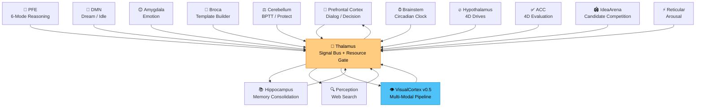
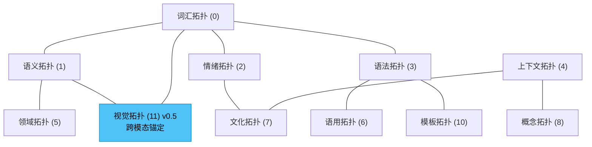
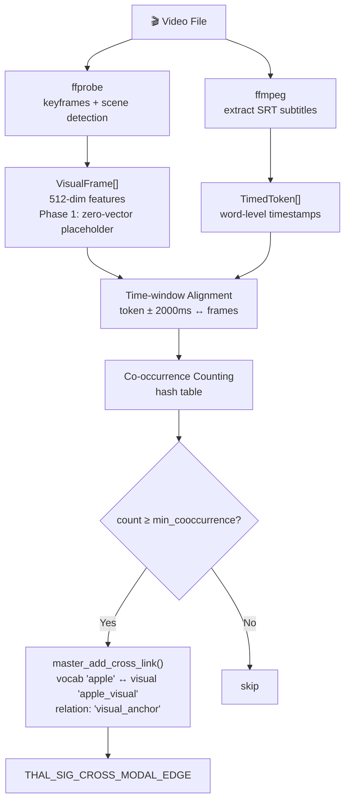
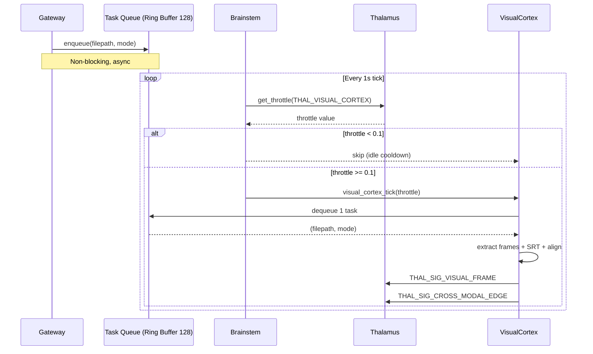
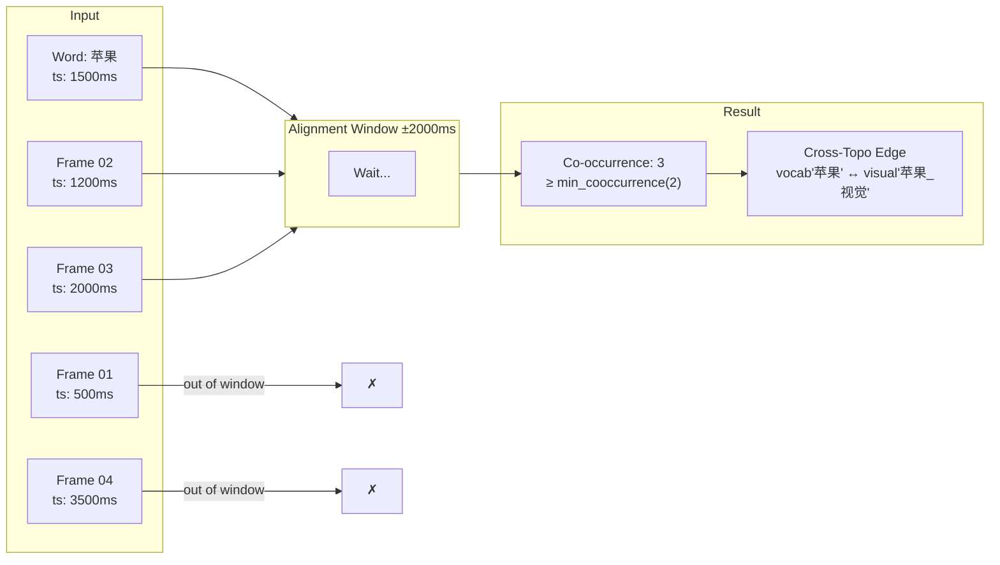
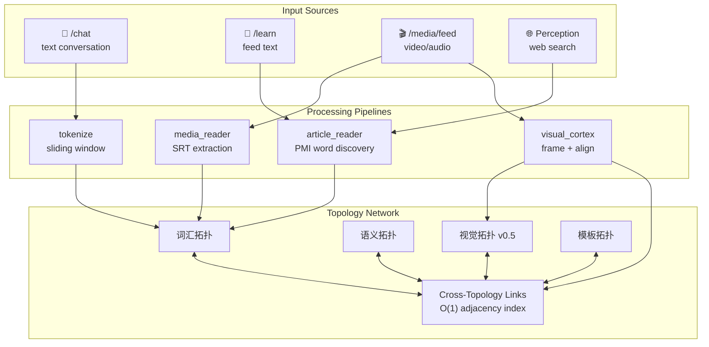
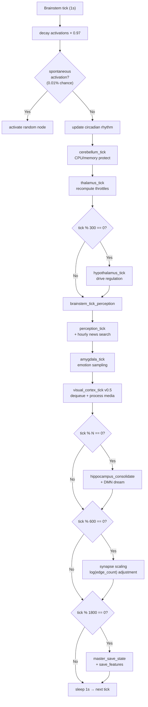

# PivotMind Architecture Diagrams

> All diagrams use Mermaid syntax. Rendered natively on GitHub.

## 1. Brain Region Architecture

## 2. Topology Layer Architecture

## 3. Multi-Modal Pipeline

### Pipeline A: Subtitle (MediaReader)

### Pipeline B: Visual Cortex (Cross-Modal Alignment)

## 4. Task Queue Model

## 5. Cross-Modal Alignment Detail

## 6. Data Flow: Input to Topology

## 7. Brainstem Tick Loop

